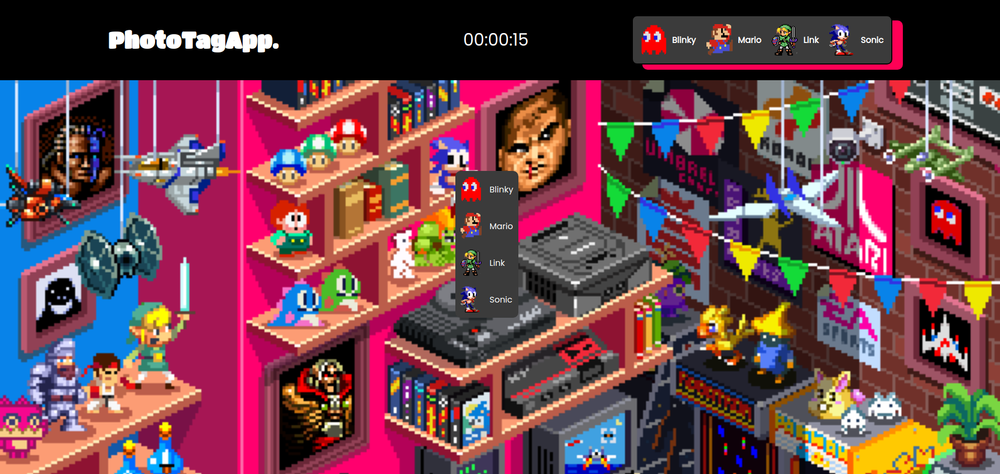

# Photo Tagging App

🔗 [View Demo](https://photo-tagging-app-lzga.onrender.com)

## Table of Contents
- [About The Project](#about-the-project)
- [Built With](#built-with)
- [Screenshots](#screenshots)
- [Features](#features)

## About The Project
A Photo Tagging Application similar to 'Where's Waldo' developed using the MERN Stack.

## Screenshots

### Initial Screen

### Level 1

### Level 2

### Level 3

### Level Complete Form

[Back to Top](#photo-tagging-app)

## Built With

[Back to Top](#photo-tagging-app)

## Features

- Character, Pixel Postion & Marker System
- Three Levels of Difficulty Ranging from Easy, Medium to Hard 
- Each Level Contains Different Characters & Wimmelbilder Illustrations
- Targeting Box That Contains a List of Possible Characters
- Appropiate Feedback if Character Selected is Either Correct or Incorrect
- Timer & Leaderboard System
- Level Complete Form
- Responsive User Interface (Includes Methods for Click Logic That Will Normalize Coordinates Across Different Screensizes)

[Back to Top](#photo-tagging-app)
